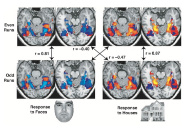

# mvpa

`mvpa` is a multi-voxel pattern analysis (MVPA) tool for fMRI data. It allows users to identify areas of the brain containing multivariate representations, from which a pair of conditions can be decoded. This is similar to the set of [searchlight tools](https://nilearn.github.io/modules/reference.html#module-nilearn.decoding) provided by nilearn, but it is based on voxel-by-voxel correlations rather than SVM classification. Such correlations are notably much faster to compute, and results for a full brain scan be generated within 10 minutes on a laptop, unlike the day(s) needed for the SVM searchlight.

This tool is adapted from the method described in _[Haxby et al., 2001](https://science.sciencemag.org/content/293/5539/2425)_, except searchlight spheres are analyzed instead of anatomical ROIs.

<p align="center">
  
  <br>
  Fig. 3 from Haxby et al. (2001)
</p>

## Installation

`mvpa` can be installed from PyPi:

```bash
$ pip install mvpa
```

## Usage Example

### Load the Haxby dataset

```python
import pandas as pd
from nilearn.datasets import fetch_haxby

# We fetch 2nd subject from haxby datasets (which is default)
haxby_dataset = fetch_haxby()

fmri_filename = haxby_dataset.func[0]
labels = pd.read_csv(haxby_dataset.session_target[0], sep=" ")
y, session = labels["labels"], labels["chunks"]
```

### Restrict to faces and houses

```python
from nilearn.image import index_img

face_mask = y.isin(["face"]) # Condition A
house_mask = y.isin(["house"]) # Condition B

face_niimg = index_img(fmri_filename, face_mask)
house_niimg = index_img(fmri_filename, house_mask)
```

### Prepare input data

```python
from nilearn.image import load_img
from mvpa import even_odd_split

face_niimg_even, face_niimg_odd = even_odd_split(face_niimg)
house_niimg_even, house_niimg_odd = even_odd_split(house_niimg)

A = [(face_niimg_even, face_niimg_odd)]
B = [(house_niimg_even, house_niimg_odd)]
mask_img = load_img(haxby_dataset.mask)
```

### Run correlation searchlight

```python
from mvpa import correlation_searchlight, significance_map

score_maps = correlation_searchlight(A, B, mask_img, radius=3)
# t_map, p_map = significance_map(score_maps, mask_img) # Only used for datasets
                                                        # with multiple subjects
```

`score_maps` is a list of paths to NIfTI files, each representing the significance scores for each voxel in a subject's scan.

### Visualize results

```python
from nilearn.image import mean_img
from nilearn.plotting import plot_stat_map

score_map = load_img(score_maps[0])
plot_stat_map(score_map, bg_img=mean_img(fmri_filename), colorbar=True,
              display_mode="z")
```


